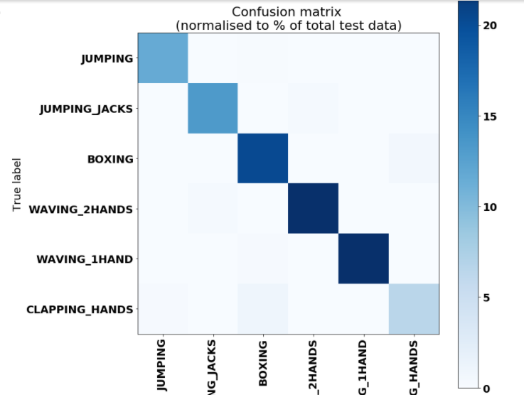

# Resarch project- Lakehead University
<h1>Deriving human activities recognition using RNN_LSTM</h1>
## Table of Contents

1. [Documentation](#documentation)
2. [Introduction](#Introduction)
3. [Prerequisites](#Prerequisites)
4. [Installation procedure](#Installation-procedure)
5. [Dataset](#Dataset)
6. [Model Information](#Model-Information)
7. [Implementation of code](#Implementation-of-code)
8. [Future Scope](#Future-scope)
9. [Result](#result)

## Documentation

- Documents that are containing in this repository are being played below:

- Rnn_lstm.ipynb --> this file contain the python code for the project
- README.md ----> This markdown file you are reading.
- Dataset ----------> dataset for the execution of the project
- Images --------> Contains the iamges for the readme file

## Introduction

Italics!

*Bold!*

*Bold-Italics!*

~strikethru~

:coffee::cat::happy:

In the words of Abraham Lincoln:

> "Pardon my French!"

## Prerequisites

cpp
int myFunc(int a int b){
    int c = a+b;
    return c;
}

## Installation Procedure

You can host websites at [Github Pages](https://pages.github.com/)!

You can also do relative links [newfile.txt](newfile.txt)

## Dataset

## Model Information

Here's a list of cool pokemon:

- Mew
- Mewtwo
- Celebi
- Arceus
- Porygon
- Mimikyu

Here's a list of my favorite pens:

1. Lamy 200
2. Herbin
3. Pilot

Here's a nested list!

1. This is a number
   1. This is a sub-number
   2. This is another sub-number
2. This is a number
   - This is a subpoint
   - This is another sub-point
     1. This is a sub-sub number

## Implementation of code

Depending on exactly what sort of project you are doing, there are a number of things that you may or may not want to include in a readme. There is really no *one true way* to do it. Readme's are a kind of artform.

_However_ there are a few things that you should consider including:

1. Name of your project.
2. Description of your project.
3. Badges.
4. Graphics / Visuals
5. Install Instructions
6. Usage (how does one use the program once it is installed.)
7. Support / Contact Details.
8. Road-map (future ideas)
9. How to contribute
10. Authors / Acknowledgements (give credit where credit is due!)
11. License
12. Project Status

## Future Scope

- This should be, simply, the name of your project.. maybe with some kind of a version Number

## Result

- This is a brief, but accurate description telling potential users exactly what your project is about. This is akin to an "abstract" in academic works. 

