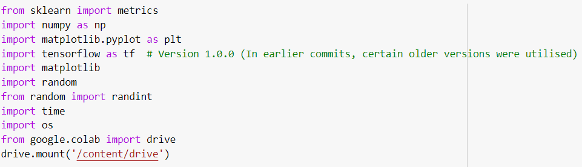
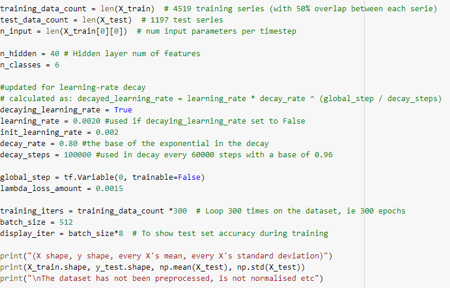
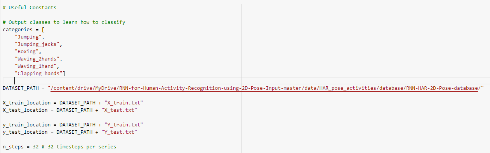
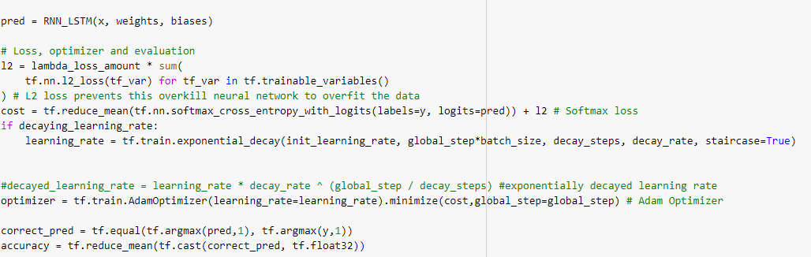
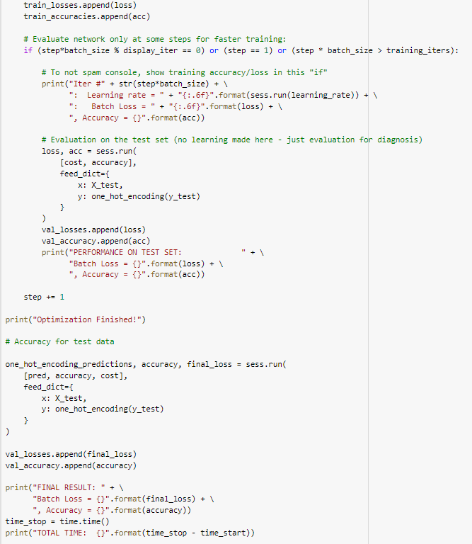
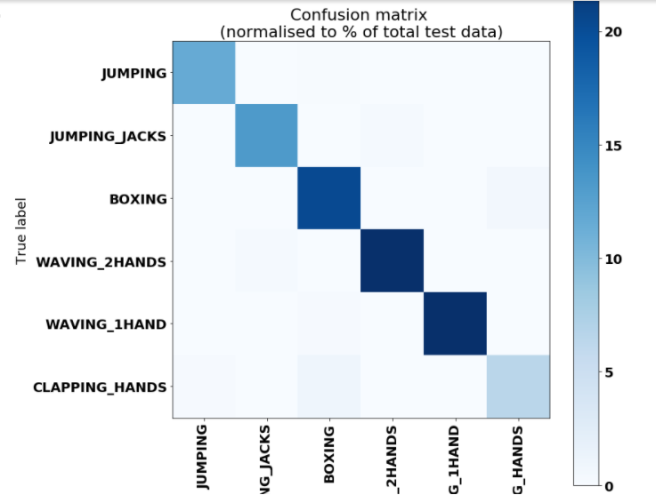
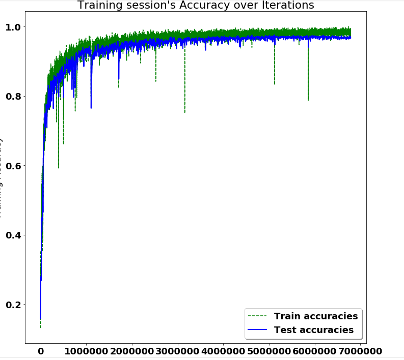

# Resarch project- Lakehead University
<h1>Deriving human activities recognition using RNN_LSTM</h1>

## Table of Contents

1. [Documentation](#documentation)
2. [Introduction](#Introduction)
3. [Prerequisites](#Prerequisites)
4. [Aim](#Aim)
5. [Dataset](#Dataset)
6. [Model Information](#Model-Information)
7. [Implementation of code](#Implementation-of-code)
8. [Future Scope](#Future-scope)
9. [Result](#result)

## Documentation

- Documents that are containing in this repository are being played below:

- Dataset ----------> dataset for the execution of the project
- Images --------> Contains the iamges for the readme file
- Rnn_lstm.ipynb --> this file contain the python code for the project
- README.md ----> This markdown file you are reading.

## Introduction
This project uses a 2D posture time series dataset and an LSTM RNN to classify human activities. The goal is to demonstrate that a sequence of 2D postures, rather than 3 dimension image or raw 2D pictures, can be used to accurately estimate a person's or animal's behavior. This is a step toward developing a system for categorising and forecasting an animal's present behavior state.
## Prerequisites
- Google colab 
- Dataset
- Tensorflow version #if not working use 1.14 version of tensforflow for palceholder
- Numpy
- Sklearn

## Aim
To see if a 2-dimensional stance can be used in activity detection with the same accuracy as a three dimensional shape. That rather than RGBD or a massive virtual reality collection, this would permit for the use of RGB only cameras for human and animal position estimate.
Adapting for usage with a big dataset organised by class and mini-batch using random sampling without replacement. When utilising a dataset sorted by class, this allows for reduced batch sizes. "It has been seen in practise that when employing a bigger batch, the model's quality, as evaluated by its capacity to generalise. 

## Dataset

The dataset contains pose estimations performed on a portion of the Berkeley Multimodal Human Action Database (MHAD) dataset http://tele-immersion.citris-uc.org/berkeley MHAD using the programme.

This dataset is comprised of 12 subjects doing the following 6 actions for 5 repetitions, filmed from 4 angles, repeated 5 times each.
- Jumping,
- Jumping_Jacks,
- Boxing,
- Waving_2hands,
- Clapping_hands.
- Waving_1hand,

In total, there are 1438 videos made up of 211200 individual frames.

## Model Information
- LSTM: An LSTM model's primary function is played by a memory cell known as a 'cell state', which retains its state throughout time. The horizontal line that goes through the top of the figure below represents the cell state. It may be compared to a conveyor belt on which data just flows. LSTMs are built to solve these issues. Long short-term memory (LSTM) is one of Deep Learning's more difficult domains. Getting your mind around LSTM is a difficult process. It is concerned with algorithms that attempt to replicate the human brain's operation in order to find the underlying correlations in sequential data. The 2-dimensional location of 18 joints throughout a timeseries of frames numbered n steps is sent into the LSTM, along with a class label for the frame series.

## Implementation of code

- <h3>Importing libraries</h3>
    
- <h3>Setting parameter</h3>
    
- <h3>preparing dataset</h3>
    
- <h3>Function implementation</h3>
    
- <h3>Train Network</h3>
    
## Result

- This project is done very accurate with the satisfied accuracy obtained after the testing result that is about 96,77\% of testing accuracy and 97.5\% of training accuracy for the precision of the analysis for the six different position for 2D stance detection of human activities.

## Future Scope

- This should be, simply, the name of your project.. maybe with some kind of a version Number

